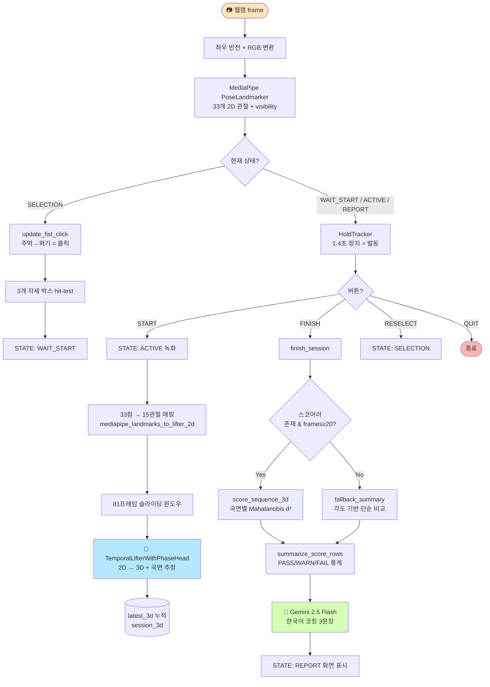
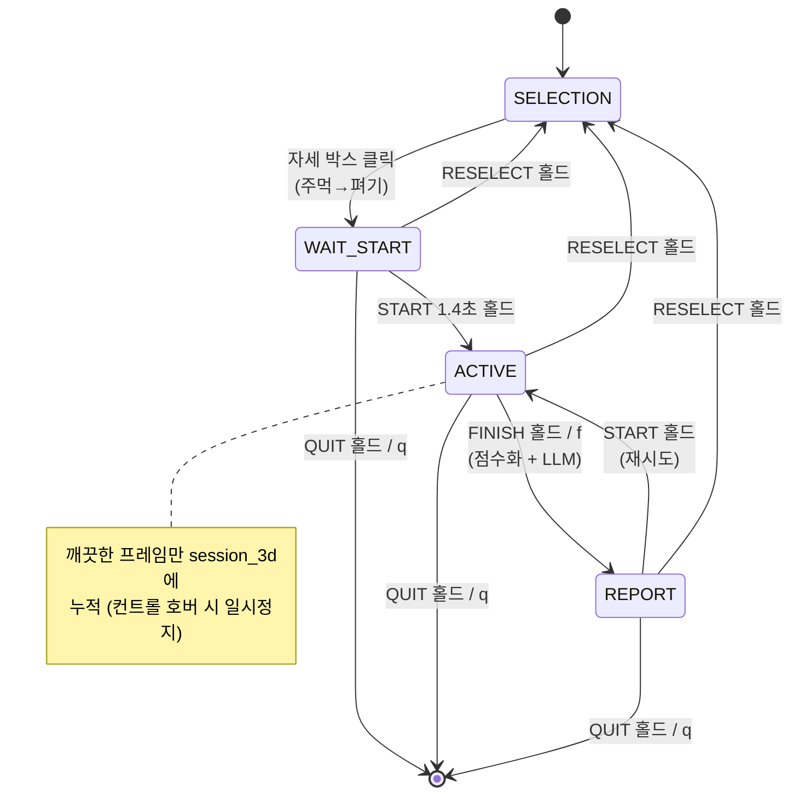
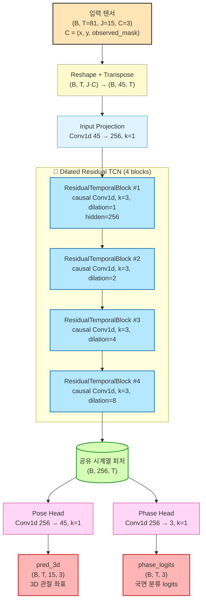
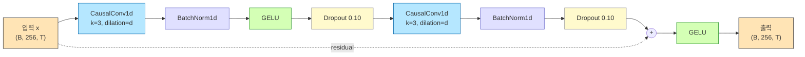
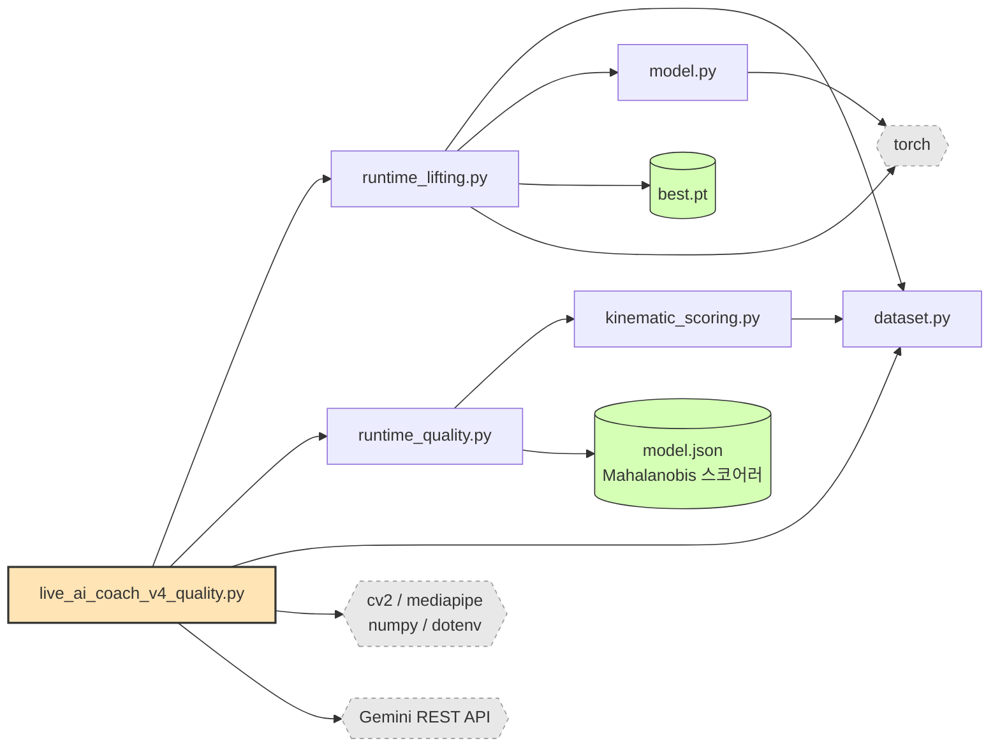

# OnPose Live Quality Coach v4 — Bundle

웹캠으로 필라테스 동작을 실시간 인식하고, 3D 자세 복원 → 품질 점수화 → Gemini LLM 한국어 코칭 피드백까지 이어지는 통합 파이프라인입니다.

이 폴더는 [`live_ai_coach_v4_quality.py`](min/min_dev_park/live_ai_coach_v4_quality.py)를 실행하는 데 **실제로 필요한 파일만** 모아둔 최소 번들입니다.

---

## 🧠 파이프라인 개요

```
웹캠 → MediaPipe Pose Landmarker (2D 33점)
     → TemporalLifterWithPhaseHead (3D 15관절 복원, 81프레임 윈도우)
     → 국면별 Mahalanobis 거리 점수화 (PASS / WARN / FAIL)
     → Gemini 2.5 Flash → 한국어 코칭 피드백 3문장
```

### 🔄 전체 데이터 흐름



### 🎮 상태 머신



### 🧠 모델 아키텍처 — `TemporalLifterWithPhaseHead`

[pilates_temporal_lifter/model.py](pilates_temporal_lifter/model.py)에 정의된 멀티태스크 시간 합성곱 모델로, **2D 관절 시퀀스 → 3D 관절 시퀀스 + 운동 국면(phase)** 을 동시에 예측합니다.



#### 🔬 ResidualTemporalBlock 내부



> 💡 **Causal 1D Convolution**: 미래 프레임을 절대 보지 않도록 좌측에만 `(k-1)·dilation` 만큼 zero-pad 후 일반 Conv1d 적용 → 실시간 추론 가능.

#### 📐 텐서 차원 변화

| 단계 | 텐서 모양 | 비고 |
|---|---|---|
| 입력 | `(B, T=81, J=15, C=3)` | (x, y, observed_mask) |
| Reshape + Transpose | `(B, 45, T)` | Conv1d용 채널-시간 배치 |
| Input Projection | `(B, 256, T)` | 1×1 conv |
| TCN 4개 block 통과 | `(B, 256, T)` | 동일 차원 유지 (residual) |
| Pose Head + reshape | `(B, T, 15, 3)` | **3D 좌표 출력** |
| Phase Head + transpose | `(B, T, 3)` | **국면 logits 출력** |

#### 🕒 시간적 수용 영역 (Receptive Field)

| Block | dilation | block당 추가 | 누적 RF |
|---|---|---|---|
| #1 | 1 | 4 | 5 |
| #2 | 2 | 8 | 13 |
| #3 | 4 | 16 | 29 |
| #4 | 8 | 32 | **61** |

> 시간 t의 출력은 과거 60프레임 + 현재 1프레임을 종합 — 윈도우 크기 81보다 작아 **causal**하게 안전 동작합니다.

#### 🎯 멀티태스크 학습 의도

- **Pose Head** — 각 시간 t에서 15개 관절의 3D 좌표 회귀 (MPJPE 등 손실)
- **Phase Head** — 같은 시간 t의 운동 국면 3-way 분류 (예: prepare / hold / release)
- **공유 백본** — 두 head가 동일한 TCN 피처를 공유하여 자세와 국면이 상호 정규화됨
- 추론 시 `predict_latest()`는 **윈도우 마지막 프레임 t=T-1** 의 출력만 취합니다.

---

### 🧩 모듈 의존성



지원 자세:
| 자세 | 한글명 | 학습된 스코어러 |
|---|---|---|
| The Seal | 더 씰 | ✅ `the_seal_mahalanobis_hip_knee_all_v2` |
| Spine Stretch | 스파인 스트레치 | ❌ (각도 fallback) |
| Bridging | 브릿징 | ✅ `bridging_mahalanobis_v1` |

---

## 📁 폴더 구조

```
live_ai_coach_v4_bundle/
├── .env                                    # GOOGLE_API_KEY (직접 채워야 함)
├── .env.example                            # 템플릿
├── pose_landmarker_heavy.task              # MediaPipe 모델 (~30MB)
├── README.md
├── min/
│   └── min_dev_park/
│       └── live_ai_coach_v4_quality.py     # 🎯 메인 실행 스크립트
└── pilates_temporal_lifter/
    ├── __init__.py
    ├── dataset.py                          # JOINT_ORDER, normalize_skeleton 등
    ├── model.py                            # TemporalLifterWithPhaseHead
    ├── kinematic_scoring.py                # mahalanobis_d2, phase_labels 등
    ├── runtime_lifting.py                  # OnlineTemporalLifter (실시간 3D)
    ├── runtime_quality.py                  # load_scorer, score_sequence_3d
    ├── requirements.txt
    └── runs/
        ├── the_seal_mahalanobis_hip_knee_all_v2/model.json
        ├── bridging_mahalanobis_v1/model.json
        ├── the_seal_progress3_angle_causal_v1/best.pt    # 우선 사용 lifter
        └── the_seal_progress3_lift_only_v1/best.pt       # fallback lifter
```

---

## ⚙️ 설치

### 1. Python 환경

Python 3.10+ 권장. 가상환경 사용을 권장합니다.

```bash
python -m venv .venv
.venv\Scripts\activate          # Windows PowerShell
# source .venv/bin/activate     # macOS / Linux
```

### 2. 의존 패키지

```bash
pip install opencv-python mediapipe numpy pandas torch python-dotenv
```

또는 `pilates_temporal_lifter/requirements.txt` 참고:

```bash
pip install -r pilates_temporal_lifter/requirements.txt
```

> 💡 GPU 사용 시 [PyTorch 공식 사이트](https://pytorch.org/get-started/locally/)의 CUDA 빌드 명령으로 설치하세요. CPU만으로도 동작합니다.

### 3. API 키 설정

`.env` 파일을 열고 Gemini API 키를 입력합니다:

```
GOOGLE_API_KEY=여기에_본인_키_입력
```

키 발급: <https://aistudio.google.com/app/apikey>

---

## ▶️ 실행

번들 루트(`live_ai_coach_v4_bundle/`)에서:

```bash
python min/min_dev_park/live_ai_coach_v4_quality.py
```

웹캠 창이 열리면 손 제스처로 조작합니다.

---

## ✋ 사용법 (제스처 UI)

### 1️⃣ 자세 선택 화면
- 화면 중앙의 **3개 박스** 중 하나 위에 손을 위치
- **주먹을 쥐었다 펴면** 클릭 (마우스처럼 동작)

### 2️⃣ 운동 화면
오른쪽 컨트롤 박스 위에 손목을 **1.4초간 정지**시켜 발동:

| 상태 | 사용 가능한 컨트롤 |
|---|---|
| `WAIT_START` | START / RESELECT / QUIT |
| `ACTIVE` (녹화 중) | FINISH / RESELECT / QUIT |
| `REPORT` | START / RESELECT / QUIT |

`ACTIVE` 상태에서 컨트롤 박스 위에 손이 닿아있으면 녹화가 일시정지되어 깨끗한 프레임만 점수화됩니다.

### 3️⃣ 결과 리포트
FINISH 후 콘솔에 다음이 출력됩니다:
- PASS/WARN/FAIL 카운트, 국면별 분포
- 가장 문제된 feature와 worst frames
- **Gemini가 생성한 한국어 코칭 피드백 3문장**

### ⌨️ 키보드 단축키
- `q` — 종료
- `r` — 자세 선택 화면으로 리셋
- `f` — 강제 FINISH 또는 마지막 리포트로 LLM 피드백 재요청

---

## 🧩 의존성 트리 (텍스트)

```
live_ai_coach_v4_quality.py
├── dataset.JOINT_ORDER
├── runtime_lifting.OnlineTemporalLifter
│   ├── dataset.{JOINT_ORDER, build_observation_mask, normalize_skeleton}
│   └── model.{TemporalLifterConfig, TemporalLifterWithPhaseHead}
└── runtime_quality.{load_scorer, score_sequence_3d, summarize_score_rows, format_summary_for_prompt}
    └── kinematic_scoring.{extract_kinematic_features, mahalanobis_d2, phase_labels_for_sequence, rolling_median, status_from_score}
        └── dataset.{PHASE_NAMES_3, PHASE_NAMES_4, coarse_progress_phase_labels, cyclic_anchor_phase_labels, normalize_skeleton, read_keypoint_csv}
```

런타임에 읽는 외부 파일:
- `.env` — GOOGLE_API_KEY
- `pose_landmarker_heavy.task` — MediaPipe 자세 검출 모델 (없으면 자동 다운로드)
- `pilates_temporal_lifter/runs/.../model.json` × 2 — Mahalanobis 스코어러
- `pilates_temporal_lifter/runs/.../best.pt` × 1 — 3D lifter 체크포인트 (causal 우선, 없으면 lift_only)

---

## ⚠️ 주의 사항

- **카메라 권한**이 필요합니다 (Windows: 설정 → 개인정보 보호 → 카메라).
- 프레임이 81개 미만이면 lifter가 첫 프레임을 패딩해 추론합니다 — 초반 몇 초는 정확도가 낮을 수 있습니다.
- 점수화 리포트는 최소 `MIN_REPORT_FRAMES = 20`개의 깨끗한 프레임이 모여야 생성됩니다. 그보다 적으면 fallback 각도 리포트로 대체됩니다.
- Spine Stretch는 학습된 스코어러가 없어 항상 fallback 모드로 동작합니다.

---

## 🔗 원본 위치

이 번들의 원본은 다음 경로에 있습니다:
- 메인 스크립트: `longstone/min/min_dev_park/live_ai_coach_v4_quality.py`
- 라이브러리: `longstone/pilates_temporal_lifter/`
